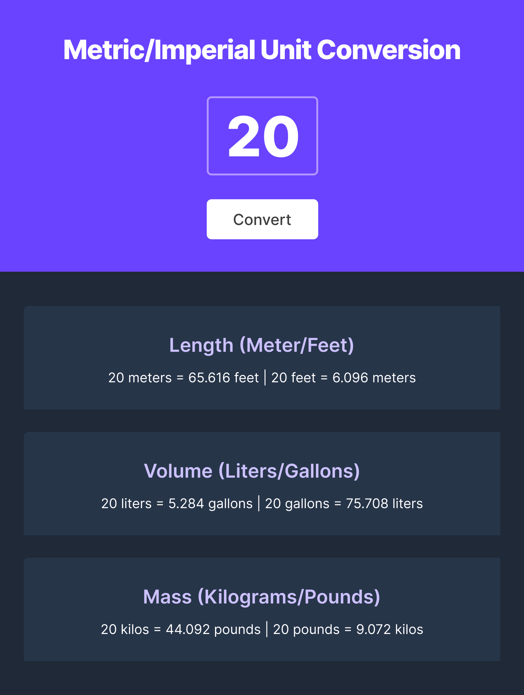

# Unit Converter

[](https://opensource.org/licenses/MIT)
[](https://www.typescriptlang.org/)
[](https://developer.mozilla.org/en-US/docs/Web/HTML)
[](https://developer.mozilla.org/en-US/docs/Web/CSS)
[](https://app.netlify.com/sites/magnificent-naiad-d70125/deploys)

A simple, elegant unit conversion web application that transforms between metric and imperial units for length, volume, and mass.



## Table of Contents

- [Features](#features)
- [Demo](#demo)
- [Technologies Used](#technologies-used)
- [Installation](#installation)
- [Usage](#usage)
- [Project Structure](#project-structure)
- [Contributing](#contributing)
- [License](#license)

## Features

- **Metric to Imperial Conversion**: Convert between:
  - Meters and Feet
  - Liters and Gallons
  - Kilograms and Pounds
- **Clean, Responsive UI**: Modern design with responsive layout
- **Real-time Conversion**: Instant results with proper decimal formatting
- **Input Validation**: Ensures only numeric input is processed

## Demo

[Live Demo](https://unit-converter.kevinngongang.dev)

## Technologies Used

- **TypeScript**: For type-safe JavaScript code
- **HTML5**: Structure of the application
- **CSS3**: Styling and responsive design
- **Modern JavaScript**: ES6+ features

## Installation

1. Clone the repository:
   ```bash
   git clone https://github.com/bakadja/unit-converter.git
   cd unit-converter
   ```

2. Install dependencies (if using a package manager):
   ```bash
   npm install
   ```

3. Run the development server:
   ```bash
   npm start
   ```

## Usage

1. Enter a numeric value in the input field
2. Click the "Convert" button
3. View the conversions for all three measurement types:
   - Length (Meters to Feet and vice versa)
   - Volume (Liters to Gallons and vice versa)
   - Mass (Kilograms to Pounds and vice versa)

## Project Structure

```
unit-converter/
├── index.html          # Main HTML file with page structure
├── package.json        # Project metadata and dependencies
├── tsconfig.json       # TypeScript configuration
├── public/              # Static assets (images)
├── src/
│   ├── script.ts       # TypeScript logic for conversion
│   └── style.css       # CSS styling
├── README.md           # Project documentation
└── LICENSE            # License information
```

### Code Highlights

The project uses TypeScript's type safety features with:
- Enums for conversion factors
- Interfaces for return types
- Error handling for input validation

## Contributing

Contributions are welcome! Please feel free to submit a Pull Request.

1. Fork the repository
2. Create your feature branch (`git checkout -b feature/amazing-feature`)
3. Commit your changes (`git commit -m 'Add some amazing feature'`)
4. Push to the branch (`git push origin feature/amazing-feature`)
5. Open a Pull Request

## License

This project is licensed under the MIT License - see the [LICENSE](LICENSE) file for details.

---

Made with ❤️ by [Kevin](https://github.com/bakadja)
